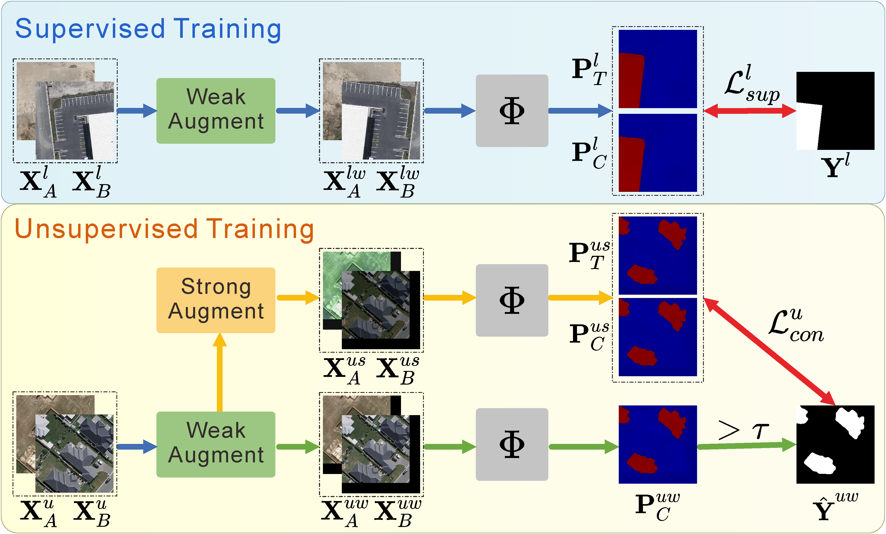
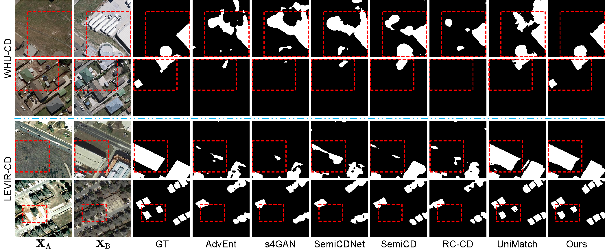

## Introduction

Welcome to the official repository of our paper "[*Cross Branch Feature Fusion Decoder for Consistency Regularization-based Semi-Supervised Change Detection*]([https://ieeexplore.ieee.org/document/10965597](https://ieeexplore.ieee.org/abstract/document/10446862))"! Our paper has been accepted by IEEE ICASSP 2024.

### Framework Overview

<div align="center">

<p><em>The architecture of our change detection network. Features from two images are compared, fused via CBFFBlocks, and classified by dual heads with consistency regularization.</em></p>
</div>

<div align="center">

<p><em>The framework of consistency regularization-based semi-supervised change detection method.</em></p>
</div>

## Results
### Quantitative Comparison on WHU-CD and LEVIR-CD
Quantitative comparison of different methods on WHU-CD and LEVIR-CD. The highest scores are marked in \textbf{bold}.
Results reported under semi-supervised settings with varying labeled data ratios (5%, 10%, 20%, 40%).

| Method | WHU-CD |  |  |  | LEVIR-CD |  |  |  |
|--------|--------|----|----|----|----------|----|----|----|
|        | IoU 5% | OA 5% | IoU 10% | OA 10% | IoU 5% | OA 5% | IoU 10% | OA 10% |
| **AdvEnt**~\cite{vu2019advent} | 57.7 | 97.87 | 60.5 | 97.79 | 67.1 | 98.15 | 70.8 | 98.38 |
| **s4GAN**~\cite{mittal2019semi} | 57.3 | 97.94 | 58.0 | 97.81 | 66.6 | 98.16 | 72.2 | 98.48 |
| **SemiCDNet**~\cite{peng2020semicdnet} | 56.2 | 97.78 | 60.3 | 98.02 | 67.4 | 98.11 | 71.5 | 98.42 |
| **SemiCD**~\cite{bandara2022revisiting} | 65.8 | 98.37 | 68.0 | 98.45 | 74.2 | 98.59 | 77.1 | 98.74 |
| **RC-CD**~\cite{wang2022reliable} | 57.7 | 97.94 | 65.4 | 98.45 | 67.9 | 98.09 | 72.3 | 98.40 |
| **SemiPTCD**~\cite{mao2023semi} | 74.1 | 98.85 | 74.2 | 98.86 | 71.2 | 98.39 | 75.9 | 98.65 |
| **UniMatch**~\cite{yang2023revisiting} | 78.7 | 99.11 | 79.6 | 99.11 | 82.1 | 99.03 | 82.8 | 99.07 |
| **Ours (Proposed)** | **81.0** | **99.20** | **81.1** | **99.18** | **82.6** | **99.05** | **83.2** | **99.08** |

| Method | WHU-CD |  |  |  | LEVIR-CD |  |  |  |
|--------|--------|----|----|----|----------|----|----|----|
|        | IoU 20% | OA 20% | IoU 40% | OA 40% | IoU 20% | OA 20% | IoU 40% | OA 40% |
| **AdvEnt**~\cite{vu2019advent} | 69.5 | 98.50 | 76.0 | 98.91 | 74.3 | 98.59 | 75.9 | 98.67 |
| **s4GAN**~\cite{mittal2019semi} | 67.0 | 98.41 | 74.3 | 98.85 | 75.1 | 98.63 | 76.2 | 98.68 |
| **SemiCDNet**~\cite{peng2020semicdnet} | 69.1 | 98.47 | 70.5 | 98.59 | 74.9 | 98.58 | 75.5 | 98.63 |
| **SemiCD**~\cite{bandara2022revisiting} | 74.6 | 98.83 | 78.0 | 99.01 | 77.9 | 98.79 | 79.0 | 98.84 |
| **RC-CD**~\cite{wang2022reliable} | 74.3 | 98.89 | 77.6 | 99.02 | 75.6 | 98.60 | 77.2 | 98.70 |
| **SemiPTCD**~\cite{mao2023semi} | 76.9 | 98.95 | 80.8 | 99.17 | 76.6 | 98.65 | 77.2 | 98.74 |
| **UniMatch**~\cite{yang2023revisiting} | 81.2 | 99.18 | 83.7 | 99.29 | 82.9 | 99.07 | 83.0 | 99.08 |
| **Ours (Proposed)** | **83.6** | **99.29** | **86.5** | **99.43** | **83.2** | **99.09** | **83.9** | **99.12** |

✅ Our method achieves state-of-the-art performance across all settings, outperforming existing semi-supervised change detection methods on both WHU-CD and LEVIR-CD datasets. 

### Visualization Results
Below are qualitative comparisons on selected samples from WHU-CD and LEVIR-CD (5% labeled setting):

<div align="center">

<p><em> Detection results of different methods on WHU-CD and LEVIR-CD at the 5\% labeled training ratio. </em></p>
</div>


## Usage


## Citation

If you find this project useful, please consider citing:

```bibtex
@inproceedings{xing2024cross,
  title={Cross branch feature fusion decoder for consistency regularization-based semi-supervised change detection},
  author={Xing, Yan and Xu, Qi’ao and Zeng, Jingcheng and Huang, Rui and Gao, Sihua and Xu, Weifeng and Zhang, Yuxiang and Fan, Wei},
  booktitle={ICASSP 2024-2024 IEEE International Conference on Acoustics, Speech and Signal Processing (ICASSP)},
  pages={9341--9345},
  year={2024},
  organization={IEEE}
}
```


## Acknowledgement

This project is based on [SemiCD](https://github.com/wgcban/SemiCD) and [UniMatch](https://github.com/LiheYoung/UniMatch). Thank you very much for their outstanding work.
